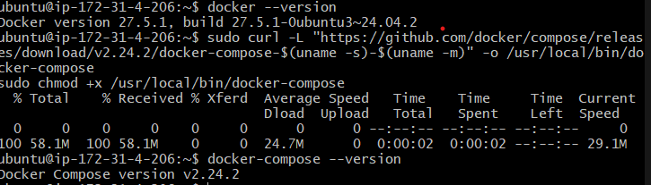
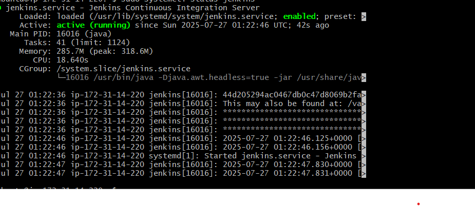
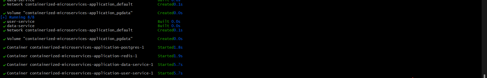
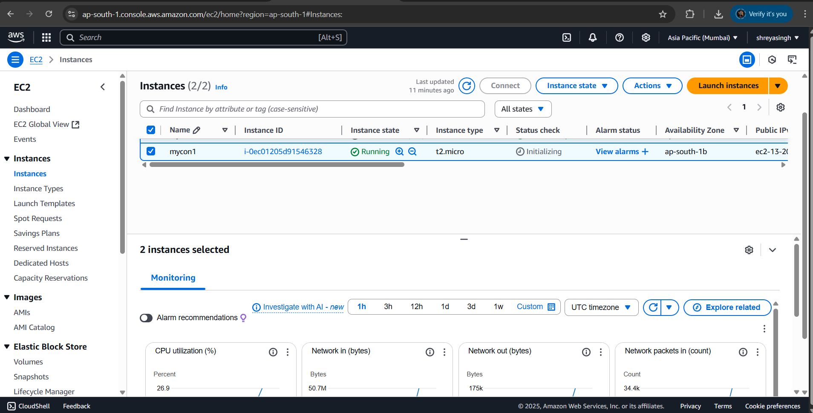
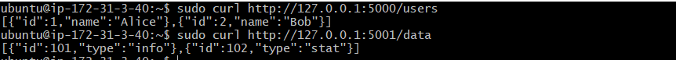

# 🚀 Containerized Microservices Application with Jenkins CI/CD

This project demonstrates a simple microservices-based architecture using Flask, PostgreSQL, Redis, and Jenkins for CI/CD, all containerized using Docker Compose.

---

## 📁 Folder Structure

Containerized-Microservices-Application/
├── Jenkinsfile
├── docker-compose.yml
├── init.sql
├── user-service/
│ ├── app.py
│ ├── Dockerfile
│ └── requirements.txt
├── data-service/
│ ├── app.py
│ ├── Dockerfile
│ └── requirements.txt

---

## 🧩 Microservices Overview

### 1️⃣ `user-service`
- A Flask-based API that communicates with the `data-service` and interacts with Redis.
- Responsible for handling user-facing logic.

### 2️⃣ `data-service`
- A Flask service responsible for PostgreSQL operations.
- Receives HTTP requests from `user-service` and responds with data.

---

## ⚙️ Technologies Used

- Docker & Docker Compose
- Flask (Python)
- PostgreSQL
- Redis
- Jenkins (CI/CD)
- GitHub (source & trigger)

---

## 🔄 CI/CD Flow (Jenkins Pipeline)

1. Code is pushed to GitHub.
2. Jenkins pulls the latest code.
3. Docker images for each microservice are built.
4. Containers are started via `docker-compose`.
5. Final running setup includes:
   - `user-service` (Flask + Redis)
   - `data-service` (Flask + PostgreSQL)

---

## 📝Jenkinsfile Stages

- **Clone Repository**
- **Build Docker Images**
- **Run Containers with docker-compose**
- **Verify Build**

---

## 📸 Screenshots

| Step | Screenshot |
|------|------------|
| Docker Versions Check |  |
| Jenkins Running |  |
| Build Success in Jenkins |  |
| Running Containers After Build |  |
| CURL Response from user-service |  |

---

##  What I Learned

- Built and Dockerized two microservices from scratch.
- Wrote clean `Dockerfile` and `requirements.txt` for each service.
- Designed Jenkins CI/CD pipeline with `Jenkinsfile`.
- Understood multi-container orchestration using `docker-compose`.
- Improved confidence in working with Redis, PostgreSQL, and Flask together.

---

